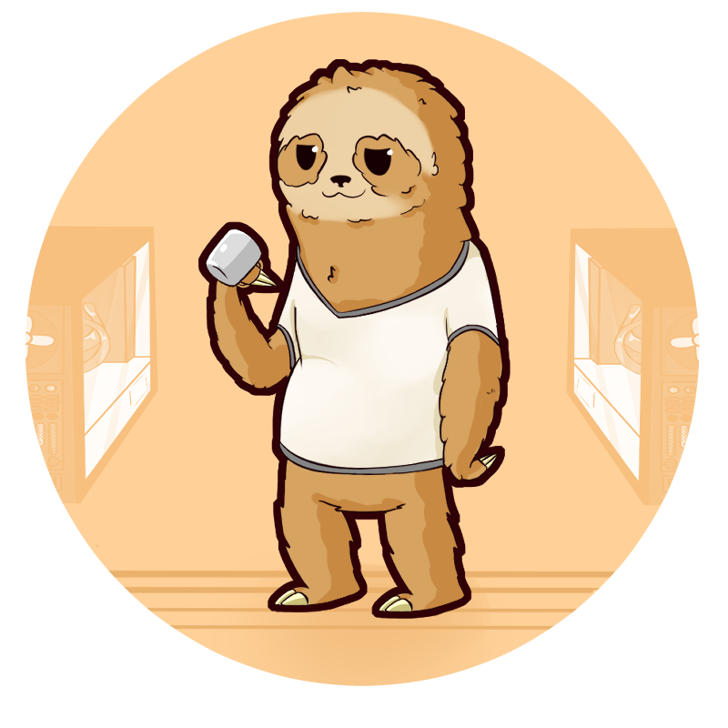

## Who am I?

Hey 👋! My name is Thorben Kuck!

I'm a very passionate software developer, focusing on applied software architecture.

Currently i am working at [open knowledge](https://www.openknowledge.de/), where i focus on enterprise development.

- 💬 Ask me about spring, i'm in a very passionate love/hate relationship with it.
- 👯 I’m looking to collaborate on Anything cool. Any framework or extension to a framework in Java (but basically whatever).
- 🔭 I’m currently working on [ddt](https://github.com/ThorbenKuck/data-driven-tests) and a sneaky, but qute major update to [netcom2](https://github.com/ThorbenKuck/NetCom2).
- 🌱 I’m currently learning anything connected to enterprise development.

### 📫 How to reach me: 

I am also running [my own website](https://thorbenkuck.de), but only as a separate side-project. The main use of the server it is running on is to test technologies and applications.

Also, there is another, separate [gitlab](https://git.thorbenkuck.de) instance, which is used for applications.

## And other than work?

I am live streaming let's codes on twitch!

> Note: Currently i am not actively streaming.

 If you are interrested in watching someone develop an application live, i encourage you to check it out.
 
- ⚡ Fun fact: There is a lot you can do with annotation processors, therebye eliminating a lot of reflection usage.
- 🤔 My motto: "Impossible" is what you call the state before you think of the solution 
